<h1 align="center">Hi 👋 I'm Intan</h1>

  

  

---
## About Me
👩‍💻 Junior Software Developer/Web Developer/AI Engineering            
🎓 BSc Computer Science, Multimedia University                                                
📂 All of my projects are available here on [GitHub](https://github.com/intanhbrh)                                         
💡 Currently exploring and learning Spring Boot                                                     
📧 Reach me at: **intanhbrh@gmail.com**  

---
## I Code With

  <!-- Frontend -->
   
  <!-- Backend & Database -->
   
  <!-- Tools -->
  

---
## My Stats

  

  

  

